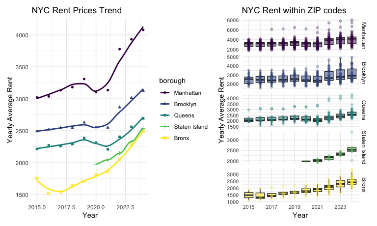

p8105_hw3_ls4236
================
Liliang Su
2025-10-04

## Problem 1

Load the data

``` r
data("instacart")
```

### Dataset Exploration and description

Firstly explore the data and check missing values.

``` r
str(instacart)
```

    ## tibble [1,384,617 × 15] (S3: tbl_df/tbl/data.frame)
    ##  $ order_id              : int [1:1384617] 1 1 1 1 1 1 1 1 36 36 ...
    ##  $ product_id            : int [1:1384617] 49302 11109 10246 49683 43633 13176 47209 22035 39612 19660 ...
    ##  $ add_to_cart_order     : int [1:1384617] 1 2 3 4 5 6 7 8 1 2 ...
    ##  $ reordered             : int [1:1384617] 1 1 0 0 1 0 0 1 0 1 ...
    ##  $ user_id               : int [1:1384617] 112108 112108 112108 112108 112108 112108 112108 112108 79431 79431 ...
    ##  $ eval_set              : chr [1:1384617] "train" "train" "train" "train" ...
    ##  $ order_number          : int [1:1384617] 4 4 4 4 4 4 4 4 23 23 ...
    ##  $ order_dow             : int [1:1384617] 4 4 4 4 4 4 4 4 6 6 ...
    ##  $ order_hour_of_day     : int [1:1384617] 10 10 10 10 10 10 10 10 18 18 ...
    ##  $ days_since_prior_order: int [1:1384617] 9 9 9 9 9 9 9 9 30 30 ...
    ##  $ product_name          : chr [1:1384617] "Bulgarian Yogurt" "Organic 4% Milk Fat Whole Milk Cottage Cheese" "Organic Celery Hearts" "Cucumber Kirby" ...
    ##  $ aisle_id              : int [1:1384617] 120 108 83 83 95 24 24 21 2 115 ...
    ##  $ department_id         : int [1:1384617] 16 16 4 4 15 4 4 16 16 7 ...
    ##  $ aisle                 : chr [1:1384617] "yogurt" "other creams cheeses" "fresh vegetables" "fresh vegetables" ...
    ##  $ department            : chr [1:1384617] "dairy eggs" "dairy eggs" "produce" "produce" ...
    ##  - attr(*, "spec")=
    ##   .. cols(
    ##   ..   order_id = col_integer(),
    ##   ..   product_id = col_integer(),
    ##   ..   add_to_cart_order = col_integer(),
    ##   ..   reordered = col_integer(),
    ##   ..   user_id = col_integer(),
    ##   ..   eval_set = col_character(),
    ##   ..   order_number = col_integer(),
    ##   ..   order_dow = col_integer(),
    ##   ..   order_hour_of_day = col_integer(),
    ##   ..   days_since_prior_order = col_integer(),
    ##   ..   product_name = col_character(),
    ##   ..   aisle_id = col_integer(),
    ##   ..   department_id = col_integer(),
    ##   ..   aisle = col_character(),
    ##   ..   department = col_character()
    ##   .. )

``` r
sum(is.na(instacart))
```

    ## [1] 0

Here is a brief description about `instacart` dataset:

- **Structure**: The dataset contains 1384617 observations (rows) and 15
  dimentions (columns), with no missing data. Each row represents a
  single product added to a customer’s grocery cart, while each column
  specifies certain information about the order.
- **Key variables**:
  - `order_id`, `user_id`: Unique identifier for orders and users.
  - `product_id`, `product_name`: Identify the ordered item and its
    name.
  - `reorder`: Whether the user had placed orders containing this
    product before.
  - `order_dow`, `order_hour_of_day`: Day of a week and specific hour
    the order was placed.
  - `department`, `department_id`, `aisle`, `aisle_id`: Specific aisle
    and department (along with their IDs) the product belongs to.
- **Illustrative examples**:
  - One observation from the dataset details a customer (User \#112108)
    who placed their 4th order on a Thursday at 10:00 AM, starting their
    shopping with Bulgarian Yogurt, which is located at Yogurt aisle,
    Dairy & Eggs department. This item was listed as reordered,
    indicating the customer had purchased it before, which reflects a
    habitual buying pattern for this everyday dairy product. The order
    occurred just 9 days after their previous one, suggesting a
    relatively frequent and consistent shopping rhythm. This example
    illustrates how the dataset captures routine purchasing behavior for
    staple grocery items.

### Answers for questions

``` r
byaisle_df = instacart |> 
  group_by(aisle) |> 
  summarise(n = n()) |> 
  arrange(desc(n))
```

1.  There are in total 134 aisles in the dataset, and the fresh
    vegetables aisle are the most items ordered from.

2.  The required graph is shown below, which is a bar plot with aisle_id
    on the x-axis and the number of items on the y-axis.

``` r
instacart |> 
  group_by(aisle_id) |> 
  summarise(n = n()) |> 
  filter(n > 10000) |> 
  ggplot(aes(x = reorder(aisle_id, n), y = n)) +
  geom_col() +
  labs(title = "Number of Items Ordered by Aisle (>10,000)", 
       x = "Aisle ID", 
       y = "Number of Items") +
  theme(
    axis.text.x = element_text(size = 8)
  )
```


3.  The required table is shown below.

``` r
instacart |> 
  filter(aisle %in% c("baking ingredients", "dog food care", "packaged vegetables fruits")) |>
  group_by(aisle, product_name) |> 
  summarise(n = n(), .groups = "drop_last") |> 
  arrange(aisle, desc(n)) |> 
  mutate(n_rank = min_rank(desc(n))) |> 
  filter(n_rank < 4) |> 
  select(-n_rank) |> 
#  slice_max(order_by = n, n = 3) |> # alternative way
  knitr::kable(digits = 2)
```

| aisle | product_name | n |
|:---|:---|---:|
| baking ingredients | Light Brown Sugar | 499 |
| baking ingredients | Pure Baking Soda | 387 |
| baking ingredients | Cane Sugar | 336 |
| dog food care | Snack Sticks Chicken & Rice Recipe Dog Treats | 30 |
| dog food care | Organix Chicken & Brown Rice Recipe | 28 |
| dog food care | Small Dog Biscuits | 26 |
| packaged vegetables fruits | Organic Baby Spinach | 9784 |
| packaged vegetables fruits | Organic Raspberries | 5546 |
| packaged vegetables fruits | Organic Blueberries | 4966 |

4.  The required table is shown below.

``` r
instacart |> 
  filter(product_name %in% c("Pink Lady Apples", "Coffee Ice Cream")) |> 
  group_by(product_name, order_dow) |> 
  summarise(mean_hour = mean(order_hour_of_day), .groups = "drop_last") |>
  arrange(product_name, order_dow) |> 
  pivot_wider(
    names_from = order_dow,
    values_from = mean_hour
  ) |> 
  knitr::kable(digits = 2)
```

| product_name     |     0 |     1 |     2 |     3 |     4 |     5 |     6 |
|:-----------------|------:|------:|------:|------:|------:|------:|------:|
| Coffee Ice Cream | 13.77 | 14.32 | 15.38 | 15.32 | 15.22 | 12.26 | 13.83 |
| Pink Lady Apples | 13.44 | 11.36 | 11.70 | 14.25 | 11.55 | 12.78 | 11.94 |

## Problem 2

### Import and tidy

Firstly, import and clean the `Zip Codes` dataset.

``` r
zip_df = 
  read_csv(file = "./data/Zip Codes.csv", na = c("NA",".","")) |> 
  janitor::clean_names() |> 
  select(-file_date, -state_fips) |> # file_date and state.fip are the same for every observations, which are redundant
  mutate(
    county_fips = as.character(county_fips),
    zip_code = as.character(zip_code)
  ) |> 
  rename(county_zip = county) # rename to differentiate bewteen both datasets
```

    ## Rows: 322 Columns: 7
    ## ── Column specification ────────────────────────────────────────────────────────
    ## Delimiter: ","
    ## chr (4): County, County Code, File Date, Neighborhood
    ## dbl (3): State FIPS, County FIPS, ZipCode
    ## 
    ## ℹ Use `spec()` to retrieve the full column specification for this data.
    ## ℹ Specify the column types or set `show_col_types = FALSE` to quiet this message.

Secondly, import and clean the `Zillow Rental Price` dataset.

``` r
zillow_df = 
  read_csv(file = "./data/Zip_zori_uc_sfrcondomfr_sm_month_NYC.csv", na = c("NA",".","")) |> 
  janitor::clean_names() |> 
  select(-region_type, -state, -state_name, -city, -metro) |> # state, state_name, region_type, metro, and city are redundant as they have the same value for every observations
  rename(zip_code = region_name, county_zillow = county_name, region_id_zillow = region_id) |> # rename to differentiate bewteen both datasets
  pivot_longer(
    cols = x2015_01_31:x2024_08_31,
    names_prefix = "x",
    names_to = "date",
    values_to = "zori"
  ) |> # tidy up the date and zori variables
  separate(
    date,
    into = c("year", "month", "day"),
    sep = "_"
  ) |> 
  relocate(year, month, day) |> 
  mutate(
    size_rank = as.integer(size_rank),
    region_id_zillow = as.character(region_id_zillow),
    zip_code = as.character(zip_code),
    year = as.integer(year),
    month = as.integer(month),
    day = as.integer(day),
    county_zillow = str_remove_all(county_zillow, " County") # remove the character "county" for all observations in the column "county_zillow"
  ) |> 
  filter(!is.na(zori)) |>  # zori is the main variable of interest, hence any row without a value can’t contribute to the analysis
  rename(borough = county_zillow) |> 
  mutate(borough = factor(recode(borough,
                          "New York" = "Manhattan",
                          "Kings" = "Brooklyn",
                          "Queens" = "Queens",
                          "Bronx" = "Bronx",
                          "Richmond" = "Staten Island"), levels = c("Manhattan", "Brooklyn", "Queens", "Staten Island", "Bronx"))
         )
```

    ## Rows: 149 Columns: 125
    ## ── Column specification ────────────────────────────────────────────────────────
    ## Delimiter: ","
    ## chr   (6): RegionType, StateName, State, City, Metro, CountyName
    ## dbl (119): RegionID, SizeRank, RegionName, 2015-01-31, 2015-02-28, 2015-03-3...
    ## 
    ## ℹ Use `spec()` to retrieve the full column specification for this data.
    ## ℹ Specify the column types or set `show_col_types = FALSE` to quiet this message.

### Analysis

``` r
# Count the number of months each ZIP code appears
zip_counts = zillow_df |> 
  group_by(zip_code) |> 
  summarise(n_months = n())

# How many ZIP codes appear in all 116 months
zip_116 = zip_counts |> 
  filter(n_months == 116) |> 
  nrow()

# How many ZIP codes appear fewer than 10 times
zip_less_10 = zip_counts |>
  filter(n_months < 10) |> 
  nrow()
```

- There are 48 ZIP codes observed 116 times.

- There are 26 ZIP codes observed fewer than 10 times

- Those always observed ZIP codes usually correspond to major
  metropolitan areas where Zillow would keep track of rental price every
  month consistently; while rarely observed ZIP codes normally
  correspond to rural or less populated areas, or areas with rare rental
  activity, so Zillow didn’t report data for every month.

### Average rent table

``` r
# Average rental price by borough and year
zillow_boro_n_yr = zillow_df |> 
  group_by(borough, year) |> 
  summarise(avg_price = mean(zori, na.rm = TRUE), .groups = "drop")

zillow_boro_n_yr |> 
  pivot_wider(
    names_from = year,
    values_from = avg_price
  ) |> 
  knitr::kable(digits = 2)
```

| borough | 2015 | 2016 | 2017 | 2018 | 2019 | 2020 | 2021 | 2022 | 2023 | 2024 |
|:---|---:|---:|---:|---:|---:|---:|---:|---:|---:|---:|
| Manhattan | 3022.04 | 3038.82 | 3133.85 | 3183.70 | 3310.41 | 3106.52 | 3136.63 | 3778.37 | 3932.61 | 4078.44 |
| Brooklyn | 2492.93 | 2520.36 | 2545.83 | 2547.29 | 2630.50 | 2555.05 | 2549.89 | 2868.20 | 3015.18 | 3126.80 |
| Queens | 2214.71 | 2271.96 | 2263.30 | 2291.92 | 2387.82 | 2315.63 | 2210.79 | 2406.04 | 2561.62 | 2694.02 |
| Staten Island | NA | NA | NA | NA | NA | 1977.61 | 2045.43 | 2147.44 | 2332.93 | 2536.44 |
| Bronx | 1759.60 | 1520.19 | 1543.60 | 1639.43 | 1705.59 | 1811.44 | 1857.78 | 2054.27 | 2285.46 | 2496.90 |

The above table shows the average rental price in each borough.

- Over the 10 years, the zori index has increased rapidly across all 5
  boroughs in NYC, reflecting a rising rents trend.

- Manhattan most of the time has ranked first by average rent prices,
  while Brown remains the lowest.

- Some boroughs like Brooklyn and Manhattan experienced sharper
  increases in 2022, indicating a rental boom.

### Plotting

``` r
zillow_line = zillow_boro_n_yr |> 
  ggplot(aes(x = year, y = avg_price, color = borough)) +
  geom_point(aes(shape = borough)) +
  geom_smooth(method = "loess", formula = "y ~ x", se = FALSE) +
  labs(
    title = "NYC Rent Prices Trend",
    x = "Year",
    y = "Yearly Average Rent"
  ) +
  theme(legend.position = "right")


# box plot
zillow_box = zillow_df |> 
  group_by(zip_code, borough, year) |> 
  summarise(avg_price = mean(zori, na.rm = TRUE), .groups = "drop") |>
  ggplot(aes(x = factor(year), y = avg_price)) + 
  geom_boxplot(aes(fill = borough), outlier.shape = NA, alpha = 0.5) +  
  # each jitter point represents the yearly average rent within a certain ZIP code
  geom_jitter(aes(color = borough), width = 0, alpha = 0.3) +
  facet_grid(borough ~. , scales = "free_y") +
  theme(axis.text.x = element_text(size = 8),
        axis.text.y = element_text(size = 8)) +
  scale_x_discrete(
    labels = c("2015","","2017","","2019","","2021","", "2023", "")
  ) +
  labs(
    title = "NYC Rent within ZIP codes",
    x = "Year",
    y = "Yearly Average Rent"
  ) +
  theme(legend.position = "none")

(zillow_line | zillow_box)
```

    ## Warning in simpleLoess(y, x, w, span, degree = degree, parametric = parametric,
    ## : span too small.  fewer data values than degrees of freedom.

    ## Warning in simpleLoess(y, x, w, span, degree = degree, parametric = parametric,
    ## : pseudoinverse used at 2020

    ## Warning in simpleLoess(y, x, w, span, degree = degree, parametric = parametric,
    ## : neighborhood radius 2.02

    ## Warning in simpleLoess(y, x, w, span, degree = degree, parametric = parametric,
    ## : reciprocal condition number 0

    ## Warning in simpleLoess(y, x, w, span, degree = degree, parametric = parametric,
    ## : There are other near singularities as well. 4.0804



Overall, the above plot shows clear temporal differences within in ZIP
codes for all available years.

- **Upward trend**: Across all boroughs, average rents show a general
  upward trend over the decade, with a significant increase in 2022,
  which is probably due to post-pandemic recovery in rental market.

- **Borough difference**: Manhattan maintains the highest rents
  throughout the period, while the Bronx and Staten Island remain the
  most affordable, and Brooklyn and Queens steadily show steady increase
  over time.

- **Variation within ZIP codes**: The spread of rents (IQR) within
  boroughs all widens in second half of the period, implying growing
  inequality between neighborhoods. In addition, several ZIP codes
  within Manhattan and Queens have very high outliers, which could be
  explained by luxury rental market.

- **Borough stability**: Queens and Staten Island show relatively narrow
  boxes and short whisker, suggesting more stable rent levels; while
  Brooklyn and Manhattan show larger spreads and longer whisker,
  indicating greater neighborhood-level and monthly variability.

``` r
zillow_mon_2023 = zillow_df |> 
  filter(year == 2023) |> 
  group_by(borough, zip_code, month) |> 
  summarise(avg_price = mean(zori, na.rm = TRUE), .groups = "drop") |> 
  ggplot(aes(x = avg_price, y = borough, fill = borough)) +
  geom_density_ridges(alpha = 0.5, scale = .8, color = "black") +
  labs(
    title = "Ridge Density plot of ZIP-code-level rent across boroughs in 2023",
    x = "Monthly Average Rent",
    y = "Borough"
  ) +
  theme(legend.position = "none")

zillow_mon_2023
```

    ## Picking joint bandwidth of 136


Overall, the ridge plot illustrates the persistent spatial inequality in
rental price distributions across NYC boroughs in 2023.

- Manhattan clearly has the highest average ZIP-level rents, centered in
  the upper range (above 4,000), with a relatively wide spread,
  indicating the inequality between neighborhoods.

- Brooklyn and Queens, especially Brooklyn, share a similar distribution
  with Manhattan, with narrower distributions and values concentrated in
  the middle range (below 3,000), reflecting diverse neighborhoods with
  both mid- and high-range rents.

- Bronx and Staten Island display lower average rents (below 2500), with
  tighter distributions around more affordable houses.

### Combine

``` r
combined_plot = zillow_box + zillow_mon_2023

ggsave("./results/borough_rental_distribution.png",
       plot = combined_plot,
       width = 12, height = 6, dpi = 300)
```

    ## Picking joint bandwidth of 136

## Problem 3

### Import and tidy

Import, merge, and clean both datasets.

``` r
nhanes_accel = read_csv("./data/nhanes_accel.csv" , na = c("NA",".","")) |> 
  janitor::clean_names()
```

    ## Rows: 250 Columns: 1441
    ## ── Column specification ────────────────────────────────────────────────────────
    ## Delimiter: ","
    ## dbl (1441): SEQN, min1, min2, min3, min4, min5, min6, min7, min8, min9, min1...
    ## 
    ## ℹ Use `spec()` to retrieve the full column specification for this data.
    ## ℹ Specify the column types or set `show_col_types = FALSE` to quiet this message.

``` r
nhanes_demo = read_csv("./data/nhanes_covar.csv", skip = 4 , na = c("NA",".","")) |> 
  janitor::clean_names()
```

    ## Rows: 250 Columns: 5
    ## ── Column specification ────────────────────────────────────────────────────────
    ## Delimiter: ","
    ## dbl (5): SEQN, sex, age, BMI, education
    ## 
    ## ℹ Use `spec()` to retrieve the full column specification for this data.
    ## ℹ Specify the column types or set `show_col_types = FALSE` to quiet this message.

``` r
nhanes_df = nhanes_demo |> 
  inner_join(nhanes_accel, by = "seqn") |>  # merge dataset
  filter(age >= 21, !is.na(sex), !is.na(age), !is.na(bmi), !is.na(education)) |> # filter participants
  mutate(
    sex = factor(sex, 
                 levels = c(1,2), 
                 labels = c("Male", "Female")),
    education = factor(education, levels = c(1,2,3),
                       labels = c("Less than high school", "High school equivalent", "More than high school"),
                       ordered = TRUE)
  ) |> # convert to factors
  pivot_longer(
    cols = starts_with("min"),
    names_to = "minute",
    values_to = "mims"
  )
```

### Table and visualization

``` r
nhanes_df |> 
  group_by(education, sex) |> 
  summarise(n = n_distinct(seqn), .groups = "drop") |> 
  pivot_wider(
    names_from = sex,
    values_from = n
  ) |> 
  knitr::kable(digits = 2)
```

| education              | Male | Female |
|:-----------------------|-----:|-------:|
| Less than high school  |   27 |     28 |
| High school equivalent |   35 |     23 |
| More than high school  |   56 |     59 |

- The above table shows that there are 12 more men than women in the
  high school or equivalent group, whereas in the other two education
  groups, the numbers of men and women are fairly comparable.

``` r
nhanes_df |> 
  ggplot(aes(x = age, fill = sex)) +
  geom_density(alpha = 0.5, ) +
  facet_grid(education ~ .) +
  labs(
    title = "Age Distributions of Men and Women by Education Category",
    x = "Age (years)",
    y = "Density",
    fill = "Sex"
  )
```


- The plot shows that age distributions differ by education groups.
  Participants with higher education levels tend to be younger on
  average for both men and women, which contrasts with with the pattern
  observed in the group with less than a high school education.

- Other than the high school equivalent education group, the age
  distributions for men and women are similar and have large overlapping
  area, suggesting no strong gender differences in age for this sample.

### Tranditional analyses

``` r
# Aggregate across minutes
nhanes_total = nhanes_df |> 
  group_by(seqn, age, sex, bmi, education) |> 
  summarise(
    total_activity = sum(mims), .groups = "drop"
  )

nhanes_total |> 
  ggplot(aes(x = age, y = total_activity, color = sex)) +
  geom_point(aes(shape = sex), alpha = .6) +
  geom_smooth(method = "loess", formula = "y ~ x", se = FALSE) +
  facet_grid(. ~ education) +
  labs(
    title = "Total activities vs. age across education groups",
    x = "Age",
    y = "Total activities"
  ) 
```


- The plot shows that total daily activity tends to decline
  significantly with age across all education groups, with younger
  participants generally having higher total MIMS values.

- Across education levels, participants with higher education levels
  tend to maintain their activity longer, showing a slower decline
  compared to those with less education.

- In terms of gender differences, women appear to have slightly lower or
  more variable activity levels compared to men, especially in higher
  education groups.

### 24-hour activity time courses

``` r
# Create new column time
nhanes_hour = nhanes_df |> 
  mutate(hour = as.numeric(str_remove_all(minute, "min")) %/% 60) |> 
  group_by(education, sex, hour) |> 
  summarise(
    avg_activity = mean(mims), # the average mims across certain gender at certain time in a certain group.
    .groups = "drop"
  )

nhanes_hour |> 
  ggplot(aes(x = hour, y = avg_activity, color = sex)) +
  geom_point(alpha = .6) +
  geom_smooth(se = FALSE, method = "loess", formula = "y~x") +
  facet_grid(. ~ education) +
  labs(
    title = "24-Hour Activity Courses by Education and Sex",
    x = "Hour of Day",
    y = "Average MIMS",
    color = "Sex"
  )
```


**Pattern & Conclusion**:

- Activity peaks in the daytime hours (around 8 a.m. to 6 p.m.) and
  declines sharply at night, which is consistent with daily human
  activity cycles.

- Across all education levels, men tend to have slightly higher activity
  levels than women in daytime.

- The gender gap in activity levels appears to expand during daytime as
  the increase of the participant’s education level, possibly reflecting
  the difference in job types affected by gender.

- Participants with lower education levels, especially male, have higher
  activity levels in daytime hours, potentially reflecting the
  difference in occupation types associated with educational background.
